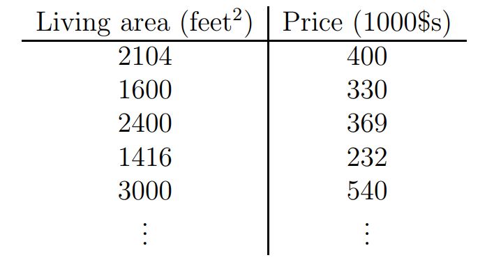
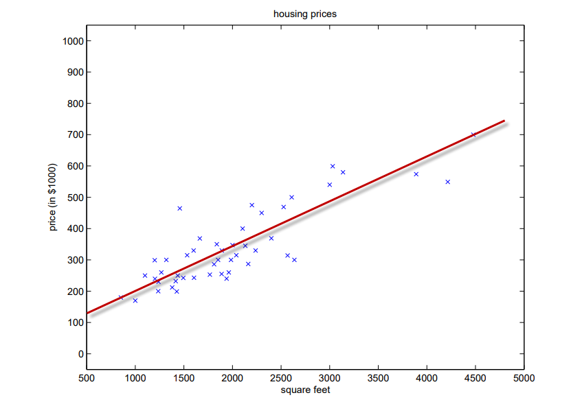

:hardbreaks:
#  Linear Regression

In statistics, linear regression is a linear approach for modeling the relationship between a scalar dependent variable y and one or more explanatory variables (or independent variables) denoted X.^[1]^

## Simple linear regression

The case of one explanatory variable is called simple linear regression.
predict house price from living area^[2]^:

## multiple linear regression

## practical uses

- predictive model (X->y)
- process missing feature (x->y, if y is missing)
- {x1, x2, ...xp}, y. quantify the strength of the relationship between y and the X~j~,

## Reference
* 1. linear regression wiki https://zh.wikipedia.org/wiki/%E7%B7%9A%E6%80%A7%E5%9B%9E%E6%AD%B8
* 2. Lecture notes for Stanford's machine learning course, aimed at graduate and advanced undergraduate students. http://cs229.stanford.edu/notes/cs229-notes1.pdf#page=7
* 3. 一元线性回归的细节 http://www.jianshu.com/p/fcd220697182