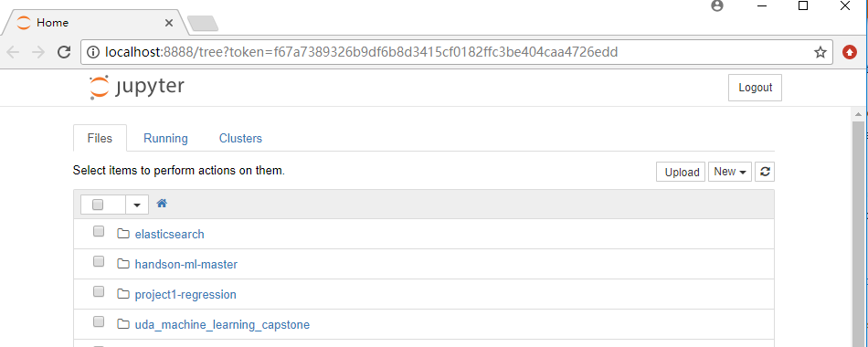

:hardbreaks:
# How to install tensorflow dev environment

This article refers to Udacity's "Deep Learning Nanodegree Foundations program"

## Prerequisites
### Windows
- Ananconda 64bit (for python 64bit >3.5)
- file https://github.com/udacity/deep-learning/blob/master/intro-to-tensorflow/environment_win.yml[environment_win.yml] (from udacity deep-learning repo)

### Linux
- Anaconda 64bit (for python 64bit >3.5)
- file https://github.com/udacity/deep-learning/blob/master/intro-to-tensorflow/environment.yml[environment.yml] (from udacity deep-learning repo)

## Installation
### Windows
conda env create -f environment_win.yml

### Linux
conda env create -f environment.yml

## Usage
activate dlnd-tf-lab
cd <your jupyter working directory>
jupyter notebook

image::images/Image-301117-021945.796.png[]

## Reference
* Udacity deep-learning repo https://github.com/udacity/deep-learning/